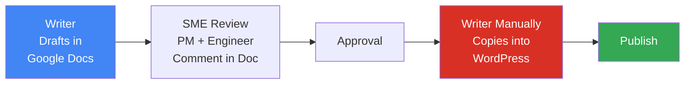
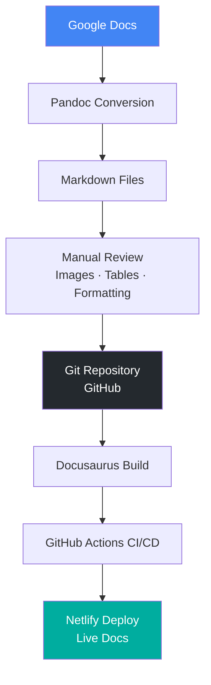
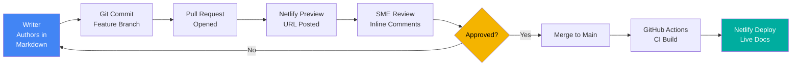

# Meridian Docs Slide Deck

## Slide 1 - Title
**Meridian Docs**

Build with Meridian

Everything you need to integrate payments, payouts, and embedded banking into your product.

---

## Slide 2 - Why Meridian Docs Exists
- Meridian is a fictional payments platform used to demonstrate a production-ready docs site.
- The site shows how technical writers can build, version, and deploy docs without needing to be software engineers.
- The project is a live demo for a "Write the Docs Bay Area" talk.

Speaker note: Open with the idea that docs are the product surface, not an afterthought.

---

## Slide 3 - What's In The Site
- 54 fully written documentation pages covering a fictional payments API.
- A custom homepage styled after Stripe's developer docs.
- A changelog powered by the built-in blog feature.
- Two sidebar trees: Docs and API Reference.
- GitHub Actions CI/CD with Netlify deploys and preview URLs.
- Dark mode support out of the box.

---

## Slide 4 - The Product Story
- Meridian sits between your application and the global financial system.
- One clean API replaces dozens of banks and card networks.
- It handles authorization, fraud scoring, currency conversion, and settlement.
- The platform includes payments, subscriptions, payouts, webhooks, and compliance.

Speaker note: Explain that the docs mirror the mental model of the platform.

---

## Slide 5 - How Meridian Works
- Your app calls the Meridian API.
- Meridian routes requests to card networks and the issuing bank.
- Meridian.js collects payment details securely in the browser.
- Webhooks keep your backend in sync with payment state.
- Test mode and live mode stay completely separate.

---

## Slide 6 - More Money, More Problems
- Meridian started with a small documentation team of 3 contributors.
- After a Series B funding round of $20 million, the product team grew and more people began contributing to docs.
- The existing publishing workflow started to break down as the docs operation scaled.
- This is the moment where docs-as-code becomes a practical solution instead of a nice-to-have.

Speaker note: Frame the problem as a scaling issue, not a tooling preference.

---

## Slide 7 - Current Documentation Workflow
- Writer creates a draft in Google Docs.
- SMEs — product manager and engineer — review and comment directly in the Google Doc.
- After the review cycle completes, the draft is approved for publishing.
- Writer manually copies, pastes, and reformats the content in WordPress, then publishes it.

Speaker note: This workflow works at small scale. It does not survive growth.

---

## Slide 8 - Bottleneck in the Current Workflow



- Google Docs has no diffs, no rollbacks, and no branches.
- Content lives in a long scrolling document — no structure, no reuse.
- The manual copy-paste step is where formatting breaks and errors are introduced.

Speaker note: The red node is where the workflow breaks down at scale. Every publish is a manual, error-prone hand-off.

---

## Slide 9 - The Technical Writer Holds Meeting With SMEs
- Everyone in the organization who works with the Google Docs feels the pain.
- Engineers and product managers meet with the technical writer to support a new solution.
- After the discussion, they decide to migrate the docs stored in Google Drive into GitHub.
- The team adopts a docs-as-code philosophy so docs can scale with the product.

Speaker note: Transition from problem to shared ownership and a better workflow.

---

## Slide 10 - The Solution: Implement Docusaurus

| Feature | WordPress | Docusaurus |
|---|---|---|
| Version control | None built-in | Git-native |
| Review workflow | Manual | Pull requests |
| Navigation | Plugins + themes | Built-in sidebar system |
| Search | Plugin required | Algolia integration |
| CI/CD | Manual or plugin | GitHub Actions |
| Cost | Hosting + plugins | Free, open source |

Speaker note: Docusaurus gives you everything WordPress needed plugins and configuration to do. It's also 65K stars, 9.9K forks, and 1,268 contributors — this is not an experiment.

---

## Slide 11 - Their Proposed Solution: Docs as Code Workflow
- Convert Google Docs content to Markdown using Pandoc.
- Manually review each file and fix images, tables, and formatting.
- Adopt Docusaurus as the static site generator.
- Track all content in Git for version control and collaboration.
- Automate builds and deploys with GitHub Actions and Netlify.

Speaker note: Each step hands off cleanly to the next tool. No manual intervention after setup.

---

## Slide 12 - The Migration Process



Speaker note: Pandoc handles the heavy lifting. The manual review step is unavoidable — no converter produces clean output on every file.

---

## Slide 13 - Common Pitfalls When Migrating From Google Docs
- **Images** break on export — each one must be re-uploaded and re-referenced manually.
- **Tables** with merged or nested cells do not convert to valid Markdown.
- **Smart quotes and em-dashes** produce garbled characters in plain text editors.
- **Heading hierarchy** is often inconsistent in Google Docs, breaking sidebar navigation.
- **Code blocks** formatted with a monospace font become plain text paragraphs, not fenced code.
- **Internal Google Docs links** become dead links after migration — each must be replaced.

Speaker note: Budget time for cleanup. A 50-page doc set can take a full day of post-conversion review.

---

## Slide 14 - Implementing Docusaurus
- Install with a single command: `npx create-docusaurus@latest meridian-docs classic`
- The classic template ships with docs, blog, navbar, and footer out of the box.
- Drop your Markdown files into the `/docs` folder — they become pages automatically.
- Run `npm start` to preview the site locally before deploying anywhere.

Speaker note: A writer with Node.js installed can have a local site running in under 10 minutes. The barrier to entry is lower than it looks.

---

## Slide 15 - The Tech Stack
- **Docusaurus v3** — static site generator and docs framework
- **Markdown / MDX** — content authoring format
- **GitHub** — version control and team collaboration
- **GitHub Actions** — CI/CD automation
- **Netlify** — static site hosting and deploy previews
- **Node.js** — local build environment

Speaker note: Every tool in this stack is free and open source. The only cost is a domain name if you want a custom one.

---

## Slide 16 - Documentation Architecture and Content Organization
- Docusaurus organizes content into three buckets: **docs**, **blog**, and **pages** — each with a distinct purpose.
- The `/docs` folder structure maps directly to sidebar navigation — your file tree is your information architecture.
- Sidebar order is controlled in `sidebars.js` or via front matter `sidebar_position` fields.
- Group content by type: conceptual overview, how-to guides, and API reference each get their own section.
- Front matter on each file controls title, description, slug, and position.

```yaml
---
title: Charge an Amount
description: Create a charge using the Meridian Payments API.
sidebar_position: 1
---
```

Speaker note: File structure decisions made here determine how users navigate the finished site. Plan the hierarchy before writing content.

---

## Slide 17 - Setting Up the Environment
- Install Node.js v18 or later.
- Scaffold the project: `npx create-docusaurus@latest meridian-docs classic`
- Install dependencies: `npm install`
- Start the dev server: `npm start` — changes hot-reload, no manual build step.
- Configure `docusaurus.config.ts` — site title, URL, navbar links, and footer all live here.

Speaker note: Writers who are not engineers can follow these steps. The dev server is the most unfamiliar part, and it's just one command.

---

## Slide 18 - Markdown and MDX Workflows
- Standard Markdown covers headings, lists, tables, code blocks, and links.
- MDX extends Markdown with JSX — React components can be embedded directly inside `.mdx` files.
- Docusaurus ships with built-in admonition syntax for callouts:

```markdown
:::tip
Use the test API key during development so live transactions are never triggered.
:::

:::warning
The `capture` field defaults to `true`. Set it to `false` for authorize-only flows.
:::
```

- Code blocks support syntax highlighting and line-level highlighting out of the box.
- Front matter handles page metadata without touching any config file.

Speaker note: Writers do not need to know React to use MDX for most work. Admonitions and tabs cover 90% of advanced formatting needs.

---

## Slide 19 - Customizing Docusaurus
- Theme colors, fonts, and logo are set in `custom.css` and `docusaurus.config.ts`.
- Navbar and footer links are declared in config — no code editing required.
- The homepage (`src/pages/index.tsx`) is a React component — fully customizable.
- Meridian's homepage is modeled after Stripe's developer docs: hero section, feature cards, and quick-start entry points.
- Algolia DocSearch is the recommended search integration — free for public open source projects.

Speaker note: Most teams customize the homepage and brand colors, then leave everything else at defaults.

---

## Slide 20 - Getting a Static Site Host: Netlify
- Netlify connects directly to a GitHub repository with a few clicks.
- Every push to `main` triggers an automatic production deploy.
- Every pull request generates a **deploy preview URL** — reviewers can read the fully rendered site before merging.
- Build command: `npm run build`
- Publish directory: `build/`
- Secrets and environment variables are set in the Netlify dashboard — never committed to code.

Speaker note: The deploy preview is the standout feature. Reviewers no longer have to imagine what the rendered output looks like — they can click through it.

---

## Slide 21 - CI/CD with GitHub Actions

```yaml
name: Deploy Docs
on:
  push:
    branches: [main]
jobs:
  build:
    runs-on: ubuntu-latest
    steps:
      - uses: actions/checkout@v4
      - uses: actions/setup-node@v4
        with:
          node-version: 20
      - run: npm ci
      - run: npm run build
```

- The workflow runs on every push to `main`.
- If the build fails, the deploy is blocked — broken docs never reach production.
- Add a link-checker step to catch dead links before they go live.
- The YAML file lives in `.github/workflows/` — versioned alongside the docs themselves.

Speaker note: Once this is set up, no one on the team touches a deploy button again.

---

## Slide 22 - Setting Up the Pull Request Workflow
- Writers create a feature branch for each doc or update: `git checkout -b docs/charge-api`
- Changes are pushed to GitHub and a pull request is opened against `main`.
- Netlify automatically posts a deploy preview link as a PR comment.
- SMEs review the fully rendered site in the preview URL — not raw Markdown.
- Reviewers leave inline comments on the diff directly in GitHub.
- After approval, the writer merges — GitHub Actions builds and Netlify deploys automatically.

Speaker note: This replaces the Google Docs comment cycle with a workflow engineers already understand.

---

## Slide 23 - The End-to-End Workflow



**Writer → Pull Request → Review → GitHub Actions → Deploy → Live Docs**

Speaker note: Everything between "merge" and "live" is fully automated. The human work is writing and reviewing.

---

## Slide 24 - Real-World Tradeoffs: Scaling, Build Times, and Maintainability

**What works well at scale:**
- Git history is the single source of truth — no content goes missing.
- Pull requests enforce a review gate — quality control is structural, not reliant on habits.
- Deploy previews eliminate the "what does this look like?" question entirely.
- Versioned docs let you maintain docs for multiple product releases simultaneously.

**What gets harder at scale:**
- Build times grow with doc count — 500+ pages can take 3–5 minutes per build.
- Non-technical contributors face a steeper learning curve than Google Docs.
- Sidebar and navigation management becomes an ongoing maintenance task as content grows.
- Advanced layouts require a writer who is comfortable with MDX and basic React.

Speaker note: Docusaurus is a stronger tool than WordPress for docs at scale, but it is not zero-maintenance. The investment pays off once the team reaches 20+ regular contributors.

---

## Slide 25 - Caveats With Scaling Docusaurus
- **Versioned docs** are powerful but add significant complexity to the build and the repo.
- **Monorepo setups** with multiple Docusaurus instances require careful CI/CD configuration.
- **Search at scale** requires an Algolia account or a self-hosted alternative like Pagefind.
- **Image management** at scale needs a CDN or consistent `/static` folder conventions.
- **SME adoption** is the real challenge — engineers and PMs need to learn Git and Markdown.
- For teams with 100+ contributors, consider a headless CMS layer on top of the Git workflow.

Speaker note: None of these are blockers. They are documented trade-offs with documented solutions. The community is large and active.

---

## Slide 26 - What Makes The Site Valuable
- Clear navigation across conceptual docs, guides, and reference material.
- A homepage that routes users to the next best task.
- Release notes that make product change visible.
- A design system that supports a polished, credible developer experience.

---

## Slide 27 - Closing
**Docs are the product experience.**

Meridian shows how a docs site can teach, convert, and reassure at the same time.

Speaker note: End by tying documentation quality to product adoption and trust.
